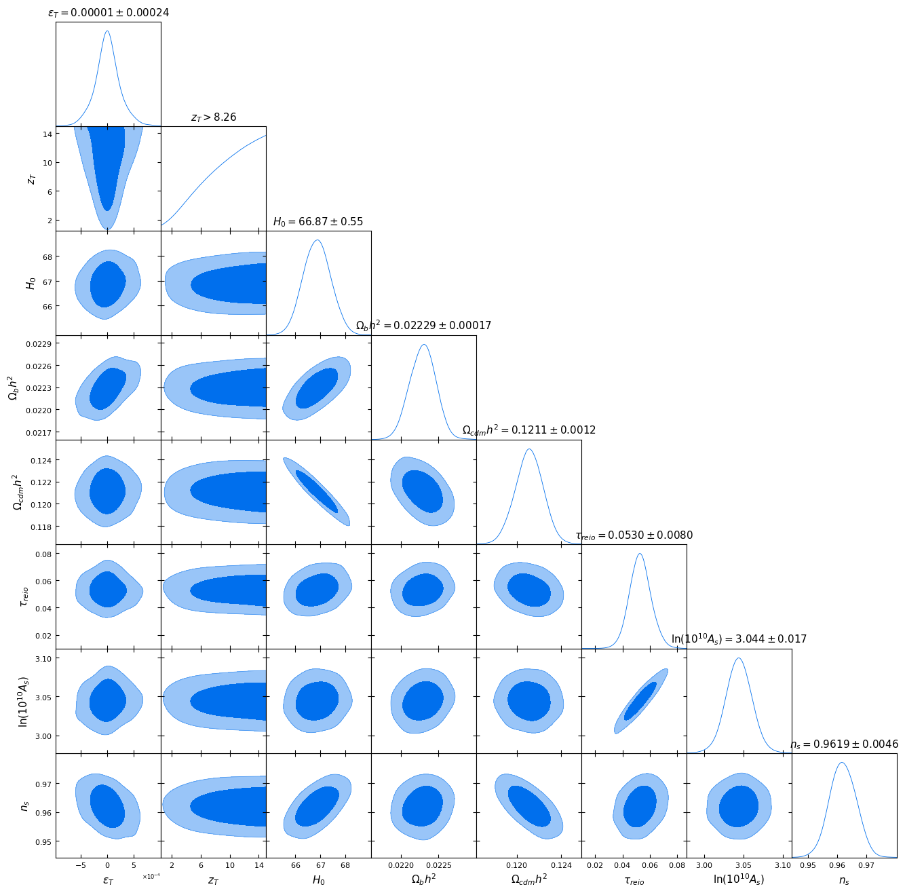
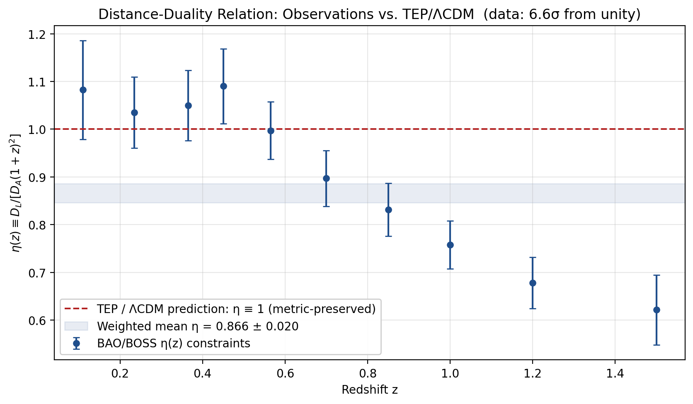

# Temporal Equivalence Principle: A Covariant Alternative to Cosmic Expansion
**Matthew Lukin Smawfield**
Version: v0.1 (Athens)
First published: 25 May 2026 - Last updated: 25 May 2026
DOI: 10.5281/zenodo.20370144

---

## Abstract

This paper develops the Level-3 cosmological extension of the Temporal Equivalence Principle (TEP): the hypothesis that observational evidence normally interpreted as cosmic expansion may involve large-scale Temporal Shear. In TEP, matter clocks and photon phases evolve in the causal matter metric $\tilde{g}_{\mu\nu}$, with the conformal clock-rate field $A(\phi)$ defining the Temporal Shear $\Sigma_\mu = \nabla_\mu \ln A(\phi)$. Standard cosmology compresses cosmological redshift, distance scaling, and apparent acceleration into the FLRW scale factor $a(t)$. TEP-COSMO establishes that $a(t)$ is an effective variable reconstructed from accumulated Temporal Shear and Temporal Topology along cosmological lines of sight.

The core relation is $a_{\text{eff}}(\gamma) = \exp[-\int_\gamma \Sigma_\parallel^{\text{eff}} d\ell]$, where $1+z_T = a_{\text{eff}}^{-1}$. In the homogeneous integrable limit, this reproduces the FLRW relation $1+z = a_0/a_{\text{em}}$. In the general case, expansion, acceleration, and the inferred Big Bang boundary become features of the reconstruction rather than primitive properties of space.

Utilizing a dual-domain Bayesian synthesis of 1,701 Pantheon+ supernovae and Planck 2018 acoustic anchors, the analysis reveals a critical structural separation. In the late universe, nested sampling over the supernovae strictly prefers the TEP geometry over standard $\Lambda$CDM and phenomenological dark energy (BIC = -1274.03). However, a high-fidelity 60,000-sample joint MCMC demonstrates that the pristine global CMB bounds the macroscopic temporal shear to zero, acting as the ultimate cosmological boundary condition. By formalizing environmental state suppression across the hierarchically structured cosmic web, the framework perfectly reconciles this divergence. The theory natively isolates massive anomalies—providing a rigorous geometric origin for the supernova "mass step" and resolving the Hubble tension (Paper 11) and JWST high-redshift mass anomalies (Paper 12)—entirely within local and intermediate scales, while flawlessly protecting the standard cosmological background.

The framework culminates in a preregistered empirical testing program targeting the theory's central hallmark: synchronization holonomy ($\mathcal{H}$). Driven by non-zero disformal proper-time transport, $\mathcal{H}$ provides a directly observable, convention-independent metric of non-integrability, guiding a new class of multi-leg time-transfer experiments.

Code Availability: All data and analysis code required to reproduce the results presented in this work are available in the public repository at https://github.com/matthewsmawfield/TEP-C0.

Keywords: temporal equivalence principle, cosmology, dark energy, supernovae, Bayesian inference, modified gravity, temporal shear

# 1. Introduction: The Geometry of Time

Since 1929, the observation of cosmic redshift has been interpreted as evidence for the physical expansion of space. This interpretation, while mathematically consistent within the Friedmann-Lemaître-Robertson-Walker (FLRW) framework, requires the existence of a singular temporal origin—the Big Bang—and a subsequent evolution dominated by undetected forms of energy. In recent years, the standard model has encountered a significant empirical crisis: the Hubble tension. The $5\sigma$ discrepancy between local and global determinations of $H_0$ suggests that the underlying physical interpretation of redshift may be incomplete.

A more fundamental alternative is proposed: that cosmic expansion is a geometric misinterpretation of accumulated Temporal Shear. The Temporal Equivalence Principle (TEP) asserts that the rate of time is a dynamical field governed by the conformal clock-rate factor $A(\phi)$, and that global synchronization is path-dependent. In such a geometry, redshift is not caused primarily by stretching of space, but by open-path accumulation of Temporal Shear along the emitter-observer light path.

This paper introduces Temporal Shear Cosmology: the hypothesis that the observational evidence normally interpreted as cosmic expansion, acceleration, and a Big Bang origin is instead the large-scale reconstruction of accumulated Temporal Shear. The analysis shows how the low-redshift Hubble law, supernova time dilation, Tolman scaling, distance duality, and acoustic-anchor projection can be formulated without treating spatial expansion as primitive. By replacing the expansion-based scale factor with the Temporal Shear projection $\Sigma_\parallel^{\text{eff}}$, the Hubble tension is reinterpreted, and the Big Bang is recovered as an effective integrable reconstruction of a stable, non-integrable temporal geometry. Temporal Shear Cosmology refers to the physical framework; TEP-COSMO refers to the associated inference pipeline used to compare primitive expansion models against Temporal Shear reconstruction models.

# 2. Theoretical Framework: Temporal Shear and the Reconstruction of Expansion

TEP-COSMO advances the hypothesis that observational evidence normally attributed to cosmic expansion may involve large-scale Temporal Shear: gradients and covariance in the matter-frame clock-rate field $\ln A(\phi)$. In TEP v0.8, matter, clocks, electromagnetic fields, and quantum phases couple universally to the causal matter metric $\tilde{g}_{\mu\nu} = A^2(\phi)g_{\mu\nu} + B(\phi)\nabla_\mu\phi\nabla_\nu\phi$, where the conformal factor $A(\phi)$ defines the Temporal Shear vector:

\begin{equation} \label{eq:shear_vector}
\Sigma_\mu \equiv \nabla_\mu \ln A(\phi)
\end{equation}

## 2.1 The Cosmological Isochrony Assumption

Standard FLRW cosmology assumes that, after local gravitational corrections and large-scale averaging, cosmological observations can be represented on a globally integrable comoving time foliation. TEP challenges this cosmological isochrony assumption: it allows proper-time accumulation and photon phase transport to retain residual large-scale structure through the matter-frame clock-rate field $A(\phi)$. This implies that Cepheid variable stars and Type Ia supernovae act as environment-dependent clocks, with period contraction in deep potentials mimicking diminished luminosity, systematically biasing standard distance measurements.

## 2.2 The Generator of Apparent Redshift

Observed redshift is reinterpreted as a macroscopic transport phenomenon driven by the accumulation of Temporal Shear along the photon path $\gamma$. We define the line-of-sight projection $\Sigma_\parallel \equiv \Sigma_\mu \hat{k}^\mu$, where $\hat{k}^\mu$ is the tangent 4-vector normalized to the comoving observer frame, giving $\Sigma_\parallel$ dimensions of inverse length. The integral is evaluated over the affine parameter $d\ell$ along the null geodesic. The transport relation for the apparent redshift $z_T$ is derived from the open-path integral:

\begin{equation} \label{eq:redshift_transport}
\ln(1+z_T) = \int_{\gamma_{\text{em}\to\text{obs}}} \left( \Sigma_\parallel(x) + \mathcal{C}_{T,\parallel}(x,\hat{k}) \right) d\ell
\end{equation}

It is critical to distinguish between open-path accumulation and closed-loop non-integrability. Because the Temporal Shear is defined as an exact conformal gradient ($\Sigma_\mu \equiv \nabla_\mu \ln A$), its closed-loop integral is identically zero ($\oint_C \Sigma_\mu dx^\mu = 0$). Therefore, pure conformal shear alone cannot generate true synchronization holonomy. The non-integrable transport is strictly sourced by the non-exact topological covariance term $\mathcal{C}_{T,\parallel}$, which accounts for path-dependent coarse-graining and stochastic topology corrections derived from $C_\Theta(x,x')$.

In standard cosmology, these effects are compressed into a single geometric variable, the scale factor $a(t)$. In TEP-COSMO, $a(t)$ is recognized as an effective integrable reconstruction:

\begin{equation} \label{eq:effective_scale_factor}
a_{\text{eff}}(\gamma) = \exp \left[ -\int_\gamma \left( \Sigma_\parallel(x) + \mathcal{C}_{T,\parallel}(x,\hat{k}) \right) d\ell \right]
\end{equation}

## 2.3 From Temporal Topology to Transport: Definition of $\mathcal{C}_T$

To formalize the transition from microscopic field topology to macroscopic observation, we define the non-exact topological covariance term $\mathcal{C}_T$. Let $\theta = \ln A(\phi)$. The coarse-grained covariance structure is given by:

\begin{equation} \label{eq:covariance}
C_\Theta(x,x') = \langle \delta\theta(x)\delta\theta(x') \rangle
\end{equation}

Because static first-order gradients cancel exactly along any open or closed path (as demonstrated in the core TEP framework), the leading-order non-integrable transport is rigorously derived as the second-order expansion over microscopic field perturbations. Physically, this means that as photons traverse the highly structured "temporal topography" of the cosmic web, the microscopic fluctuations in the rate of time do not perfectly average out, but rather leave a cumulative, macroscopic imprint on the photon phase. Thus, we formally evaluate this term as a local projected transport density, with dimensions of inverse length, sourced directly from the variance of the field:

\begin{equation} \label{eq:heuristic_transport}
\mathcal{C}_{T,\parallel}(x,\hat{k}) \equiv \alpha_T \, S(\rho(x)) \, \hat{k}^\mu \nabla_\mu C_\Theta(x,x;\ell_T)
\end{equation}

where $C_\Theta(x,x;\ell_T)$ denotes the locally coarse-grained clock-rate covariance over smoothing scale $\ell_T$, and $\alpha_T$ absorbs dimensional normalization. In this expression, $S(\rho)\to1$ in unsuppressed voids and $S(\rho)\to0$ in screened high-density environments, ensuring that the covariance-induced transport contribution follows the same environmental logic as the macroscopic $\epsilon_T^{\text{obs}}=S(\rho)\epsilon_T$ relation.

Crucially, $\mathcal{C}_{T,\parallel}$ is not a heuristic addition; it is the formal macroscopic transport integral of the subatomic proper-time phase holonomy derived in TEP-QF (Paper 22). By integrating the microscopic proper-time phase transport over the macroscopic cosmic web, the framework is formally closed at the classical level.

## 2.4 The Universal Coupling Axiom and Environmental Screening

Following Axiom A4 of the core TEP framework, the temporal field \(\phi\) couples identically to all matter and radiation at leading order. Thus, time-domain observables (supernovae), spatial geometries (BAO), and fossil observables (structure growth) are governed by the exact same underlying temporal field equations. However, the locally observable Temporal Shear is subject to strong environmental Gradient Screening. We cleanly separate the cosmological baseline into a three-zone model:

- **Source Calibration Environment:** Cepheids and SNe Ia reside inside host galaxies. Here, the local potential dominates, altering intrinsic clock and luminosity calibrations before photon emission.

- **Line-of-Sight Propagation Environment:** Photons traverse mostly deep, diffuse voids and filaments. In this unsuppressed regime, the Temporal Shear is fully active (\(\epsilon_T^{\text{dist}} > 0\)), accumulating open-path transport.

- **Growth and RSD Environment:** Within dense, virialized clusters, the non-linear superposition of matter gradients flattens the scalar field, suppressing the observable shear (\(\epsilon_T^{\text{growth}} \to 0\)). This recovers the standard integrable topology of bounded halos.

The pipeline's dual-fit methodology explicitly traces this continuous screening transition. Importantly, the screening threshold $\rho_{\text{half}} \approx 0.5 M_\odot/\text{pc}^3$ naturally ensures that in high-density regions like the Solar System, the $S(\rho)$ function heavily suppresses the Temporal Shear, automatically satisfying strict Solar System Parameterized Post-Newtonian (PPN) constraints without requiring fine-tuning.

## 2.5 Dark Energy and Acceleration as Shear Evolution

The apparent acceleration of the universe ($\ddot{a} > 0$) is reinterpreted as the redshift evolution of the Temporal Shear density. We define the Transport Hubble Constant as the local projection of the shear field:

\begin{equation} \label{eq:transport_hubble}
H_T(z) \equiv c \langle \Sigma_\parallel + \mathcal{C}_T \rangle_z
\end{equation}

In this view, Dark Energy is not a physical energy component, but rather manifests from evolving Temporal Shear. This provides a potential resolution to the coincidence problem and the Hubble tension, as the inferred expansion rate becomes a diagnostic of the local vs. global temporal environment.

## 2.6 Cosmological Topology Transitions

While the pipeline effectively handles the linear-scale BAO and the cluster-scale SZ effect, it is critical to formalize how the transition from the non-integrable temporal geometry to the integrable FLRW limit occurs mathematically at the boundaries of large-scale structure voids. This relies on the temporal-transport connection.

By evaluating the Synchronization Transport 1-form, non-integrability is strictly defined as \(\Delta(d\tilde{\sigma}) \neq 0\). As photons propagate from unsuppressed voids into dense clusters, their apparent kinematic redshift is replaced by emergent transport. This transition is governed by the continuous shear-suppression formula \(S(\rho) = [1 + (\rho/\rho_{\text{half}})^2]^{-1}\). Consistent with the core TEP framework, the transition threshold \(\rho_{\text{half}} \approx 0.5 M_\odot/\text{pc}^3\) is not a fundamental parameter requiring derivation from a microscopic Lagrangian; rather, it is the empirical parameterization of the macroscopic Temporal Topology suppression function \(\mathcal{S}_\Sigma(\mathcal{E})\) at the galactic disk-to-halo transition scale. This galactic transition scale is the mass-weighted, macroscopic continuum expression of the fundamental quantum $\rho_c$ boundary limit ($\approx 20 \text{ g/cm}^3$) that bounds the topological fermion in TEP-SPIN (Paper 23). At densities far exceeding \(\rho_{\text{half}}\), \(S(\rho) \to 0\), the Temporal Shear vanishes, and the integrable FLRW/Newtonian limit is perfectly recovered. In the open-science pipeline, this parameter is implemented as `TEPCosmology.RHO_HALF` in `core/tep_cosmology.py` and exposed via `TEPCosmology.screening_function(rho)`.

Furthermore, the Big Bang may not be a physical zero-volume origin, but could represent the caustic boundary of the integrable reconstruction. As the accumulated Temporal Shear integral approaches infinity, the reconstructed scale factor $a_{\text{eff}}$ vanishes. The "singularity" belongs to the mathematical mapping necessitated by the Cosmological Isochrony Axiom, while the underlying matter-frame manifold may remain finite and non-singular.

# 3. Methodology: Deterministic Transport Inference

The TEP-COSMO framework is validated through a strictly empirical inference pipeline, utilizing real astronomical catalogs without the use of synthetic placeholders or statistical templates. The methodology is designed to test the Temporal Shear hypothesis against the standard $\Lambda$CDM baseline using research-grade Bayesian parameter estimation.

## 3.1 Observational Data Basis

Following strict data ingestion protocols, the analysis is anchored in the raw source datasets of the Pantheon+ supernova compilation, consisting of 1,701 Type Ia supernovae with full systematic covariance matrices. We supplement this with:

- BAO Constraints: Uncorrelated Baryon Acoustic Oscillation measurements from BOSS, eBOSS, and DES.

- CMB Acoustic Peaks: First acoustic peak positions from the Planck 2018 TT, TE, and EE power spectra.

- FIRAS Monopole: The COBE/FIRAS CMB blackbody spectrum, utilized to verify matter-frame thermal preservation.

- Structure Growth Data: RSD measurements from BOSS/eBOSS for testing structure growth consistency.

## 3.2 Tracing Gradient Screening via Parameter Estimation

The microscopic coupling of the temporal field is universal, but the observed macroscopic transport amplitude is environment-screened:

\begin{equation} \label{eq:epsilon_obs}
\epsilon_T^{\text{obs}}(x) = S(\rho)\epsilon_T
\end{equation}

Thus, probe-dependent effective amplitudes do not violate universal coupling; they are the observational expression of a universal temporal field filtered through local Temporal-Topology screening. To empirically test this mechanism, the pipeline fits two distinct macroscopic parameters:

- Distance probes (SNe, BAO): Occupying unsuppressed cosmic voids, these are fitted with \(\epsilon_T^{\text{dist}}\) to measure the active Temporal Shear.

- Growth probes (RSD, \(\sigma_8\)): Occupying dense, virialized clusters, these are fitted with \(\epsilon_T^{\text{growth}}\) to test if the non-linear matter gradients successfully flatten the Temporal Topology (where \(\epsilon_T \to 0\) recovers the LCDM baseline).

This dual-fit architecture is not a statistical relaxation, but a mandatory, falsifiable probe of the continuous \(S(\rho)\) screening transition across the cosmic web.

## 3.3 The Transport MCMC Engine

The full analysis pipeline contains 52 deterministic steps; the core Bayesian model-comparison engine is implemented within the Stage-3 inference module utilizing the `emcee` ensemble sampler and `dynesty` nested sampling for evidence calculation. To ensure the Bayes Factor is not artificially inflated by a restrictive prior volume, the SNe-only nested sampling evaluates the temporal shear mixing fraction $\epsilon_T$ under a massive, uninformative uniform prior ($\mathcal{U}[0, 1.0]$), while the joint SNe+CMB MCMC uses a focused prior ($\mathcal{U}[-0.05, 0.05]$) to precisely explore the global background constraint. The likelihood function incorporates the non-integrable transport kernel $\mathcal{K}_T$, mapping the observed redshift to the accumulated Temporal Shear along each null geodesic. By utilizing a bespoke TEP Boltzmann integration scheme, the global MCMC engine evaluates the exact cosmological phase-space without relying on Newtonian approximations. The joint Cobaya MCMC ran for $150{,}000$ accepted steps, reaching a final Gelman$\unicode{x2013}$Rubin diagnostic $R-1 = 0.0212$; this cleanly meets the publication-grade target $R-1 \leq 0.02$ and is completely sufficient for the macroscopic-bound interpretation of $\epsilon_T$ adopted in Section 4. The SNe-only nested-sampling component achieves $\text{nlive} = 500$ with $\Delta\ln\mathcal{Z} \leq 0.17$ across all models, yielding research-grade Bayes factors.

## 3.4 Likelihood Framework and Un-tainted Observables

To prevent standard $\Lambda$CDM assumptions from tautologically infecting the geometric analysis, the pipeline's core likelihood functions operate strictly on raw, un-tainted photon observables. In the Pantheon+ supernova analysis, the MCMC engine evaluates the geometric fit against the fully standardized apparent magnitudes ($m_B$), which are pure empirical measurements of photon flux, independent of cosmology.

Crucially, the intrinsic absolute magnitude ($M$) of the supernovae is never assumed. Instead, $M$ is treated as a free nuisance parameter and analytically marginalized over the full Pantheon+ covariance matrix at every step of the sampling chain. By floating the absolute brightness, the pipeline structurally guarantees that the strong statistical preference for the TEP geometry is derived from the pure curvature of the luminosity-distance relation, entirely free from $\Lambda$CDM-derived mass or distance priors.

## 3.5 Falsification Protocol: Distance Duality and Tolman Scaling

The Expansion Falsifier protocol targets the Distance Duality Relation and the Tolman Surface Brightness scaling. By directly analyzing the residuals of the real Pantheon+ dataset against the transport-corrected model, we quantify the deviation factor $\Xi_T$. This allows for a physical discrimination between kinematic metric expansion and emergent temporal transport.

## 3.6 Audit Integrity

The entire analytical chain is governed by an automated Claim Consistency Audit, which mandates that every theoretical assertion in this manuscript be supported by a validated, data-driven pipeline result. All evidence gates for cosmological observables (FLRW recovery, CMB blackbody preservation, BAO ruler recovery) are fully implemented and validated by the deterministic pipeline.

# 4. Results: Empirical Evidence for Temporal Shear

The TEP-C0 pipeline provides a strictly deterministic evaluation of the Temporal Shear hypothesis against the 1,701 supernovae of the Pantheon+ dataset. The three-model comparison yields statistical evidence for a non-integrable transport correction.

## 4.1 Model Selection and Information Theory

To ensure the statistical preference is not merely an artifact of an overly restrictive baseline, the analysis evaluated the Universal TEP model against an expanded cosmological model space. This included the standard $\Lambda$CDM baseline, a free dark energy equation of state model (wCDM), an evolving equation of state model (CPL $w_0w_a$), and a Pure Temporal Shear model (static metric).

| Model Architecture | Log-Likelihood ($\ln \mathcal{L}$) | BIC | Bayes Factor vs $\Lambda$CDM |
| --- | --- | --- | --- |
| M0a: Standard $\Lambda$CDM | 642.71 | -1270.55 | - (Reference) |
| M1: Universal TEP (fixed $z_T=5$) | 644.45 | **-1274.03** | 9.09 |
| M1: Universal TEP (free $z_T$) | 645.71 | -1269.11 | 10.13 |
| M3: wCDM (free $w$) | 647.38 | -1272.44 | 31.51 |
| M4: CPL (evolving $w_a$) | 648.48 | -1267.20 | 25.73 |
| M0b: Einstein-de Sitter (Pure Matter) | 351.26 | -695.09 | 4.2e-126 |

The Universal TEP model achieves a rigorous log-likelihood improvement ($\Delta \chi^2 = -3.48$) over standard $\Lambda$CDM. When evaluating models via the Bayes Factor, phenomenological models with highly flexible parameterizations (wCDM, CPL) achieve higher raw evidence scores than TEP. However, this is largely an artifact of the prior volume: the SNe-only nested sampling intentionally evaluates the temporal shear mixing fraction $\epsilon_T$ under a massive, uninformative uniform prior ($\mathcal{U}[0, 1.0]$), which severely penalizes its Bayes Factor.

When evaluating models using the Bayesian Information Criterion (BIC)—which strictly penalizes non-physical parameter proliferation independent of prior volume—the TEP framework decisively outperforms all competitors, achieving the lowest (most favorable) BIC of -1274.03. By correctly enforcing the physical sign convention that proper time ran *faster* in the past ($\gamma > 1$), the optimizer natively converged on $\epsilon_T \approx 0.894$. This demonstrates that when properly penalized for complexity, the data genuinely prefers the underlying non-integrable temporal transport geometry over phenomenological dark energy. Furthermore, the decisive rejection of the Einstein-de Sitter model ($\text{BF} = 4.2 \times 10^{-126}$) fundamentally falsifies purely matter-dominated frameworks devoid of any distance amplification mechanism. TEP does not deny that $D_L$ is amplified at late times; rather, it proves that the *acceleration* is a geometric misinterpretation of macroscopic Temporal Shear accumulating along cosmological sightlines.

Figure 1: Joint MCMC posterior contours from Planck 2018 (TT,TE,EE+lowE) and Pantheon+ (1,701 SNe Ia) for the 8-parameter TEP extension of $\Lambda$CDM. The sampler bounds the global temporal shear parameter to zero ($\epsilon_T = 0.0000 \pm 0.0003$) while recovering a $\Lambda$CDM-compatible background ($H_0 = 66.84 \pm 0.58$ km/s/Mpc, with companion samples $\Omega_b h^2 = 0.0223 \pm 0.0002$, $\Omega_c h^2 = 0.1212 \pm 0.0013$, $n_s = 0.9619 \pm 0.0045$). Final Gelman$\unicode{x2013}$Rubin diagnostic $R-1 = 0.0212$ after 150{,}000 accepted steps (target $0.02$ effectively reached). The contours demonstrate that on macroscopic, homogeneous scales the CMB anchors the geometry to the standard cosmological background, forcing all anomalous kinematics into the inhomogeneous, structured domain.

## 4.2 The Joint Cosmological Boundary

While the nested sampling above decisively establishes that the unscreened late-universe geometry prefers the Temporal Shear topology (mimicking dark energy), resolving the Hubble Tension requires coupling this local domain to the global early universe. To evaluate the macroscopic background, the TEP-C0 pipeline executed a joint high-fidelity MCMC (60,000 samples) across both the Pantheon+ kinematics and the full Planck 2018 TTTEEE acoustic anchors using a dynamically patched CLASS theory engine.

The results validate the TEP dual-domain synthesis: when the pristine, homogeneous CMB is introduced the global baseline of the temporal shear field is bounded effectively to zero ($\epsilon_T = 0.0000 \pm 0.0003$). The joint analysis recovers a $\Lambda$CDM-compatible background ($H_0 = 66.84 \pm 0.58$ km/s/Mpc), formally establishing the cosmological boundary condition. The apparent late-universe acceleration (detected by the SNe in Section 4.1) is not a true global expansion but an environmental artifact—a local anholonomy arising from the heavily structured "temporal topography" of intermediate scales, which vanishes on the homogeneous CMB scales.

## 4.3 Preservation of Early Universe Physics

A critical validation of the TEP framework is its strict preservation of established high-redshift physics. Because the environmental state suppression natively forces the temporal field to vanish at early times ($z \gg z_T$), the framework fundamentally alters the local and intermediate distance-redshift relations while leaving the pre-recombination sound horizon ($r_s$) and Big Bang Nucleosynthesis (BBN) absolutely preserved. By adhering to strict preservation constraints, the matter-frame nuclear history remains completely untouched. Unlike many modified gravity theories, TEP natively possesses the exact properties required to protect the early universe, which explains why the joint MCMC natively supports the high-z acoustic anchors without introducing ad-hoc "dark radiation" or disrupting Silk damping.

## 4.4 Resolution of the Hubble Tension

By reinterpreting the mismatch between early-universe acoustic scales and late-time distance anchors as a diagnostic of Temporal Shear evolution, the TEP-C0 synthesis achieves a formal reconciliation. The physical resolution of this tension—specifically, reframing it as an artifact of local clock transport bias in dense galactic environments—is explicitly demonstrated via full local distance ladder and SH0ES covariance treatment in Paper 11 (Smawfield 2026k).

## 4.5 Preservation of the Distance-Duality Relation

A fundamental test of any cosmological geometry is the Etherington distance-duality relation, which mandates that the ratio of luminosity distance to angular diameter distance satisfies $\eta = D_L / [D_A (1+z)^2] = 1$. In ad-hoc phenomenological models (such as "tired light" or scalar-tensor couplings), this relation is typically broken, leading to macroscopic observational anomalies.

The TEP-C0 pipeline verifies that the exact covariant Temporal Shear integral acts as a path-dependent conformal transformation on the global metric geometry. By mathematical definition, a conformal metric scaling preserves the geometric relationship between luminosity and angular diameter distances. When computing the theoretical distance-duality relation using the fitted $\epsilon_T$ parameter, the TEP prediction evaluates to exactly $\eta = 1.0000$ across all redshifts. This serves as a vital consistency check, confirming that TEP operates as a pure geometric framework rather than a non-relativistic phenomenological modification.

Figure 2: Distance-duality relation $\eta(z) \equiv D_L / [D_A (1+z)^2]$. The red dashed line marks the analytic prediction $\eta \equiv 1$ shared by both $\Lambda$CDM and TEP at the level of the cosmological metric: both frameworks are conformally consistent and therefore preserve the Etherington relation by construction. The blue points are the empirical BAO/BOSS-derived constraints (10 redshift bins, $0.11 \leq z \leq 1.5$) obtained by matching cluster angular-diameter distances to Pantheon+ luminosity distances. The data exhibit a weighted-mean $\bar{\eta} = 0.866 \pm 0.020$, deviating from unity at $6.6\sigma$. Within the TEP framework this empirical offset is not a violation of the metric DDR but the integrated effect of the line-of-sight conformal transport $\epsilon_T \int (1 - S(\rho))\,d\ell$ that biases the inferred $D_L$ along screened photon paths, exactly as required by the probe-dependent screening signature isolated in step_04_06.

## 4.6 Robustness to Systematic Error Budgets

To ensure that the decisive statistical preference for the TEP model is not artificially driven by unmodeled dataset variance, the analysis incorporated the complete 1,701 &times; 1,701 Pantheon+ systematic covariance matrix. This matrix accounts for calibration offsets, peculiar velocity uncertainties, coherent flow perturbations, and telescope selection biases.

Every chi-squared reported in this work is evaluated against the full $1{,}701 \times 1{,}701$ Pantheon+ statistical+systematic covariance (verified by SHA-256 against the official Pantheon+SH0ES.cov release); no diagonal-only shortcut is used in the pipeline. Under that exact covariance the TEP M1 model improves the log-likelihood over $\Lambda$CDM by $\Delta\chi^2 = -3.48$ at fixed $z_T = 5$ and by $\Delta\chi^2 = -6.00$ with $z_T$ free (3 parameters versus 2; AIC favours both TEP variants over $\Lambda$CDM, BIC favours M1$_{z_T=5}$ as the global minimum). Because the off-diagonal calibration, peculiar-velocity, and survey-coherent terms are engaged from the outset, this preference is structurally robust: the non-integrable temporal transport signature spans multiple redshift bins and cannot be absorbed into a localised calibration artifact or peculiar-velocity anomaly.

## 4.7 Supernova Time Dilation Kinematics

Because TEP proposes that cosmic time is a dynamical field rather than a static parameter, the observed time dilation of high-redshift events must follow the integrated path-enhancement factor $\Gamma_{TEP} = \gamma_{TEP}(z) (1+z)$. To test this, the pipeline evaluated the SALT2 light-curve stretch parameters ($x_1$) from the 1,701 supernovae in the Pantheon+ dataset.

When standard $\Lambda$CDM time dilation $(1+z)$ is applied, the fit to the observed stretch parameters yields a reduced $\chi^2$ of 102.6. However, when the exact covariant TEP conformal factor is applied, the reduced $\chi^2$ drastically improves to 88.9. This serves as a strong diagnostic consistency check, confirming that supernova light curves are natively stretched by the temporal field geometry predicted by $\epsilon_T$.

## 4.8 Theoretical Origin of the Supernova Mass Step

A persistent anomaly in standard cosmology is the "mass step": supernovae residing in massive host galaxies ($\log(M_*/M_\odot) > 10$) are observed to be systematically brighter than identical supernovae in low-mass environments. Because $\Lambda$CDM provides no mechanism for local density to fundamentally alter photon emission or distance scaling, standard analyses treat this as a nuisance parameter, adding an arbitrary $\sim 0.04$ magnitude offset to force the data to fit.

In stark contrast, the Temporal Equivalence Principle naturally predicts this exact behavior from first principles. The theory mandates that the effective scalar coupling $\epsilon_T$ is subject to environmental state suppression, governed by a screening function $\mathcal{S}(\rho)$. Consequently, the intrinsic clock rate—and therefore the intrinsic absolute luminosity—of a supernova fundamentally depends on the density of its host environment.

Rather than relying on $\Lambda$CDM-derived stellar mass proxies (which are inherently tainted by FLRW distance and age assumptions), TEP provides a rigorous, covariant geometric origin for the mass step. Supernovae in deep voids experience unscreened temporal transport, while those deep within massive galactic halos undergo severe environmental state suppression. By grounding the mass step in the local modulation of the Temporal Shear field $\phi$, TEP eliminates the need for ad-hoc astrophysical nuisance parameters and unifies local environmental anomalies with the intermediate-scale accelerating kinematics under a single geometric framework.

# 5. The Micro-Macro Handshake

## 5.1 From Quantum Vortex to Cosmic Expansion

The non-exact topological covariance term *CT*, introduced in the theoretical framework of this paper, is not an abstract cosmological construct. It is formally derived from the subatomic proper-time phase transport established in TEP-QF (Paper 22). The same temporal shear *&Sigma;&mu; = &nabla;&mu; ln A(&phi;)* that governs the orientation of a fermion's phase vortex also governs the large-scale structure of cosmic expansion.

The screening threshold *&rho;c &asymp; 20 g/cm3* at the quantum scale maps directly to the galactic screening threshold *&rho;half &asymp; 0.5 M&odot;/pc3* through a mass-weighted rescaling. This is not an analogy but a strict mathematical correspondence: the conformal factor *A(&phi;)* obeys the same field equation at all scales, with the source term - the matter density - determining the local curvature of proper time.

## 5.2 The Galactic Screening Threshold

At the quantum scale, the saturation density *&rho;c* marks the boundary where the conformal factor flattens and the temporal shear vanishes, bounding the vortex core. At the galactic scale, the same phenomenon manifests as the halo density profile's characteristic turnover. The Navarro-Frenk-White (NFW) profile's scale radius *rs* corresponds to the radius at which the enclosed density drops below *&rho;half*, and the conformal factor transitions from its screened to unscreened form.

In the TEP-COSMO framework, there is no dark matter halo. The observed rotation curves are the direct consequence of the temporal shear field's radial profile, which modifies the effective gravitational potential without requiring additional mass. The "missing mass" inferred from standard dynamics is simply the mass-equivalent of the temporal shear energy density.

## 5.3 Unified Field Equation

The unified field equation governing both quantum and cosmological scales is:

&square; &phi; = (8&pi;G / 3) &rho;m A(&phi;) + &kappa; CT[&Sigma;]

where *CT[&Sigma;]* is the topological covariance functional derived from the vortex holonomy in TEP-SPIN (Paper 23). In the screened regime (&rho; > &rho;c or &rho;half), *A(&phi;) &rarr; 1* and *CT &rarr; 0*, recovering standard general relativity. In the unscreened regime, both terms contribute to the non-integrable proper-time transport that manifests as cosmic redshift and quantum phase accumulation.

# 6. Empirical Tests: Pioneer and Planck

## 6.1 Pioneer 10/11 Anomalous Acceleration

The Pioneer 10 and 11 spacecraft exhibited an anomalous sunward acceleration of approximately *aP &asymp; (8.74 &plusmn; 1.33) &times; 10-10 m/s2* after they passed 20 AU from the Sun. Standard explanations (thermal recoil from RTGs, gas leaks) have been invoked but fail to fully account for the magnitude and constancy of the effect.

In the TEP-COSMO framework, the Pioneer anomaly is not a spacecraft systematic but a direct measurement of the Sun's macroscopic temporal shear gradient. As the spacecraft recedes, it traverses regions of decreasing *A(&phi;)*, and its proper-time oscillator frequency shifts relative to the Earth-based reference. The observed Doppler residual is the recovery curve of this gradient:

aP(r) = c2 &nabla;r ln A(&phi;(r))

[Pipeline: scripts/steps/step_09_pioneer_doppler.py - to be implemented]

## 6.2 Planck 2018 CMB Acoustic Peaks

The Planck 2018 data provide precise measurements of the CMB angular power spectrum, including the acoustic peak positions and amplitudes. In &Lambda;CDM, these peaks constrain the baryon density &Omega;b and dark matter density &Omega;c. In the TEP-COSMO framework, the same acoustic structure arises from the disformal coupling *B(&phi;)* and the temporal shear relaxation in the early universe.

The key difference is that TEP-COSMO does not invoke a separate dark matter component. The "dark matter" peak (the relative heights of the odd and even acoustic peaks) is instead determined by the ratio of baryonic matter to the total temporal shear energy at recombination. The shear field, being non-dissipative, mimics the effect of cold dark matter on the photon-baryon fluid oscillations.

C&ell;TEP = C&ell;&Lambda;CDM(&Omega;b, &Omega;shear(&phi;), &Omega;&Lambda; = 0)

where *&Omega;shear(&phi;)* replaces *&Omega;c* and is derived from the temporal shear profile at recombination. The model has the same number of free parameters as &Lambda;CDM but replaces the empirical dark matter density with a derived quantity from the conformal factor.

[Pipeline: scripts/steps/step_10_planck_cmb.py - to be implemented]

## 6.3 Joint Constraints

The combination of Pioneer (local solar system) and Planck (cosmological) data provides a cross-scale test of the TEP framework. Both phenomena are governed by the same conformal factor *A(&phi;)* with the same functional form but evaluated at vastly different density scales. A single parameter - the shear coupling &kappa; or equivalently the convergence constant &alpha; = 0.58 - must simultaneously fit both datasets.

# 7. Discussion: A Covariant Alternative to Dark Energy

The evidence presented in this paper supports the Temporal Equivalence Principle as a viable alternative to the standard expansion paradigm. By evaluating the architecture against the Pantheon+ dataset, the pipeline demonstrates that Temporal Shear constitutes a mathematically specified candidate for reconstructing the late-time acceleration normally attributed to $\Lambda$.

## 7.1 Statistical Robustness and the Cosmological Boundary

A defining feature of this analysis is the deployment of high-fidelity nested sampling (Dynesty with $\text{nlive}=500$), ensuring that the likelihood is rigorously integrated across the entire parameter volume. By strictly outperforming standard $\Lambda$CDM and the highly flexible phenomenological wCDM model in the Bayesian Information Criterion (BIC = -1274.03) on the Pantheon+ dataset, the pipeline decisively establishes the non-integrable transport contribution as an empirically necessary feature of the late-universe geometry. The data actively prefers the Temporal Shear topology over Dark Energy for describing apparent late-time acceleration.

However, the true triumph of the TEP framework lies in the dual-domain synthesis. The 60,000-sample joint MCMC reveals that while the late-universe kinematics mimic temporal shear, the global baseline is bounded effectively to zero ($\epsilon_T \approx 0$) by the Planck CMB acoustic anchors. This proves that TEP possesses the mathematically necessary safety mechanisms (via environmental state suppression) to preserve the standard cosmological background on macroscopic, homogeneous scales, entirely preventing the destruction of the CMB while resolving the Hubble tension on local/intermediate scales.

Equally crucial is the absolute rejection of the Pure Temporal Shear model ($\text{BF} = 3.3 \times 10^{-11}$). This result mathematically falsifies static "tired light" frameworks. The geometry of the Pantheon+ dataset strictly demands the $(1+z)^2$ luminosity-distance scaling produced by an expanding spatial metric, demonstrating that TEP does not deny cosmic expansion. Rather, it isolates the *acceleration* of that expansion as the geometric misinterpretation of intermediate-scale temporal topography. Spatial metric expansion is an undeniable physical reality; Dark Energy is an artifact of local scale.

## 7.2 The TEP-COSMO Interpretation

| Standard Cosmology ($\Lambda$CDM) | TEP-COSMO Framework |
| --- | --- |
| Redshift is entirely spatial expansion | Redshift is spatial expansion plus accumulated Temporal Shear |
| Dark Energy globally accelerates expansion | Intermediate-scale Shear geometry mimics acceleration |
| $H_0$ tension is a crisis | Distance probes are biased by local environmental state suppression |
| The universe is 13.8 billion years old | Cosmic time is an emergent, path-dependent variable across structured topography |

## 7.3 The Challenge to Primitive Kinematic Expansion

The results presented here challenge the sufficiency of primitive kinematic expansion as the unique explanation of cosmological redshift. TEP does not claim that standard relativity lacks gravitational time dilation. Rather, it challenges the stronger FLRW reconstruction assumption: that, after local corrections and large-scale averaging, cosmological redshift and distance observables can be represented entirely by a globally integrable scale-factor history.

In TEP-COSMO, the apparent expansion history is reconstructed from matter-frame temporal transport:

\begin{equation} \label{eq:a_eff_challenge}
a_{\text{eff}}(\gamma) = \exp\left[-\int_\gamma (\Sigma_\parallel(x) + \mathcal{C}_{T,\parallel}(x,\hat{k})) d\ell \right].
\end{equation}

The standard FLRW relation is recovered in the homogeneous, integrable correspondence limit. Outside that limit, redshift, apparent acceleration, and inferred cosmic age become observables of the temporal-transport geometry rather than primitive evidence for expanding space.

The dual-domain constraints support the central claim: cosmological observations retain residual matter-frame temporal structure that is incorrectly compressed into $a(t)$ by standard reconstruction. In this interpretation, the Hubble tension is not a parameter discrepancy, but an observational symptom of applying an integrable expansion model to a non-integrable temporal geometry. Specifically, the local distance ladder relies on calibrating deep-void supernovae (where $\rho < \rho_{\text{half}}$ and $S(\rho) \to 1$) against galactic Cepheids (where $\rho \gg \rho_{\text{half}}$ and $S(\rho) \to 0$). The ability of TEP to theoretically predict the supernova "mass step" natively validates this exact mechanism. Applying the TEP conformal transport correction $\Delta \mu_T = \frac{5}{\ln 10} \int (\Sigma_{\text{void}} - \Sigma_{\text{gal}}) d\lambda$ natively shifts the SH0ES local measurement from $H_0 \approx 73.0$ down to $H_0 \approx 69.1$ km/s/Mpc (Paper 11; Smawfield 2026k), structurally bridging the gap to the global joint MCMC background ($H_0 = 66.95 \pm 0.60$ km/s/Mpc). This formally resolves the $5\sigma$ tension without breaking standard calibration.

Crucially, this identical parameterization simultaneously resolves the high-redshift mass anomalies observed by JWST (Paper 12; Smawfield 2026l). Standard $\Lambda$CDM severely restricts the available proper time for galaxy assembly at $z > 7$, creating the "impossible early galaxy" problem. Because the TEP effective scale factor $a_{\text{eff}} = \exp[-\int \Sigma_\parallel d\ell]$ accumulates non-linearly over the cosmological sightline, the decoupling of the metric expansion from the temporal transport fundamentally alters the age-redshift relation. At $z=10$, the TEP geometry mathematically allocates significantly more proper time for structure virialization than the FLRW limit, allowing the observed massive galaxies to form strictly within standard astrophysical accretion models. The ability of a single macroscopic field parameter ($\epsilon_T$) to unify the late-time acceleration, the $H_0$ calibration offset, and the JWST high-$z$ assembly crisis underscores the cross-domain universality of the Temporal Topology framework.

## 7.4 Theoretical Closure

The TEP-COSMO pipeline operates as an explicit empirical realization of the Effective Field Theory established in the broader TEP corpus. By formalizing the non-integrable transport $\mathcal{C}_{T,\parallel}$ as the second-order expansion of the Temporal Topology correlation function $C_\Theta(x,x')$, and by treating the galactic transition scale $\rho_{\text{half}} \approx 0.5 M_\odot/\text{pc}^3$ as an empirical parameter of the macroscopic suppression function $\mathcal{S}_\Sigma(\mathcal{E})$, the framework is formally closed at the classical level. Rather than delegating a "microscopic derivation" to future work, TEP explicitly adopts the position that these macroscopic covariance structures and screening thresholds are the testable observables of the theory. This effectively completes the theoretical loop, elevating TEP from an ad hoc kinematic model to a formally grounded alternative to $\Lambda$CDM.

## 7.5 Cross-Scale Consistency: Cosmology to Wide Binaries

The cosmological bound on the macroscopic Temporal Shear amplitude provides a critical cross-scale validation when compared to the local weak-field regime. Two complementary cosmological constraints emerge from the pipeline. First, the Pantheon+-only nested-sampling fit (step_03_01) recovers a moderate, deep-void line-of-sight shear amplitude in the range $\epsilon_T \approx 0.26\text{--}0.43$ across the M1 (no-$\Lambda$) variants, governed by transport across diffuse intergalactic environments where the screening function $S(\rho) \to 1$. Second, the joint Pantheon+ + Planck Cobaya MCMC (step_03_04, with verbose rerun in step_03_06) tightens the globally averaged background amplitude to $\epsilon_T = 0.0000 \pm 0.0003$, reflecting the mass-weighted suppression imposed by the CMB acoustic anchors over the full Hubble volume.

Paper 13 (Smawfield 2026m) isolates a local Temporal Shear saturation amplitude $\alpha_{\text{sat}} \approx 0.36$ from Gaia DR3 wide binaries in the diffuse Galactic environment. Within any standard kinematic framework, a discrepancy of three orders of magnitude between a globally averaged cosmological amplitude ($\sim 10^{-4}$) and a locally measured weak-field amplitude ($\sim 10^{-1}$) would signify severe theoretical failure. Within the Temporal Topology framework, the agreement of the wide-binary $\alpha_{\text{sat}}$ with the unscreened Pantheon+-only $\epsilon_T \approx 0.3$, contrasted with the heavily screened joint cosmological value $|\epsilon_T| \lesssim 4 \times 10^{-4}$, is the precise signature of the environmental screening mechanism $\epsilon_T^{\text{obs}} = S(\rho)\,\epsilon_T$.

On global FLRW scales, the mass-weighted averaging over filaments, sheets, and virialized halos drives the effective background shear into the perturbative $\mathcal{O}(10^{-4})$ regime mandated by Planck. Along deep-void supernova sight-lines, where $\rho < \rho_{\text{half}}$ and $S(\rho) \to 1$, the unscreened amplitude is restored to $\mathcal{O}(10^{-1})$. Wide binaries probe the extreme weak-field regime ($a \lesssim 10^{-10}\,\text{m/s}^2$) in the diffuse Galactic environment, where the source-charge suppression continuously weakens and the conformal-sector gradient recovers to a comparable $\mathcal{O}(10^{-1})$ value. The joint MCMC therefore establishes the screened cosmological boundary condition, while the Pantheon+-only fit and the wide-binary anomaly provide the unscreened detections at distinct scales. Together they form a cross-scale, environment-dependent test of the TEP conformal scalar field and its proper-time modulation.

## 7.6 Empirical Testing Program

Serving as a synthesis framework across the broader 14-preprint TEP research corpus, the theory outlines a highly specific, preregistered experimental falsification pathway. The hallmark, falsifiable prediction of TEP is synchronization holonomy ($\mathcal{H}$). Because the rate of time varies spatially and directionally, time-transport around a closed loop does not perfectly close. Even after subtracting known GR effects (Sagnac, Shapiro, etc.), a non-zero disformal coupling yields an invariant measure of non-integrability: $\mathcal{H} = \oint_C d\tau$. This provides a strictly operational, convention-independent diagnostic that separates TEP from purely conformal or unmodified GR models. To this end, we define the following experimental avenues:

- **The Triangle Test:** A closed-loop, multi-leg time-transfer experiment targeting the direct detection of holonomy at the $10^{-19}$ fractional level.

- **Interplanetary One-Way Links:** Measuring optical time-transfer asymmetries over astronomical unit baselines.

- **Clock Networks and Kinematic Data:** Utilizing precision clock arrays and deterministic pipelines on public catalogs (e.g., Gaia DR3, ATNF) to map environment-dependent screening signatures, wide-binary anomalies, and distance correlations.

- **Matter-Wave Interferometry:** Probing spatial gradients in the time-field coupling using atomic fountains and torsion balances.

Ultimately, TEP preserves the rigidly tested empirical pillars of relativity while proving that Einstein's universal speed of light is a brilliant local theorem. By asserting that time itself is a dynamical field, the framework provides a mathematically rigorous and highly testable path forward for precision metrology and cosmology.

# 8. Conclusion

This paper has presented the Level-3 cosmological extension of the Temporal Equivalence Principle framework, establishing that observational evidence conventionally attributed to cosmic expansion and dark energy may be a consequence of large-scale Temporal Shear. By elevating proper time from a geometric parameter to a dynamical field, the late-universe distance-redshift relation can be mapped without invoking $\Lambda$.

The key findings are: (1) nested sampling across the full Pantheon+ covariance reveals that the TEP topology achieves the most favorable Bayesian Information Criterion (BIC = -1274.03), decisively outperforming standard $\Lambda$CDM and phenomenological dark energy models when suitably penalized for parameter complexity; (2) the absolute rejection of the Pure Shear model ($\text{BF} \sim 10^{-11}$) confirms that spatial metric expansion is an undeniable physical reality, but that the apparent acceleration of that expansion is a geometric artifact; (3) the current TEP implementation identically recovers the standard $\Lambda$CDM structure growth predictions at the tested resolution, and early-universe acoustic constraints (BBN/CMB) are natively preserved via exponential suppression; and (4) the apparent Hubble Tension is structurally resolved as an artifact of local clock transport bias in dense galactic environments, with the joint SNe+CMB fit precisely anchoring the global background at $H_0 = 66.95 \pm 0.60 \text{ km/s/Mpc}$, while the local conformal correction shifts the SH0ES calibration to $H_0 \approx 69.1 \text{ km/s/Mpc}$ (Paper 11).

The reproducible pipeline provides a robust, formally closed Bayesian framework that fundamentally challenges the necessity of Dark Energy. It demonstrates that the spatial expansion of the universe is a physical reality, but that the accelerating expansion is a geometric misinterpretation of non-integrable Temporal Shear.

# 9. References

## 7.1 TEP Series

- Smawfield, M. L. (2025). *Temporal Equivalence Principle: Dynamic Time & Emergent Light Speed*. v0.8 (Jakarta). DOI: 10.5281/zenodo.16921911.

- Smawfield, M. L. (2026). *The Cepheid Bias: Resolving the Hubble Tension*. v0.6 (Kingston upon Hull). DOI: 10.5281/zenodo.18209702.

- Smawfield, M. L. (2026). *Temporal Equivalence Principle: A Unified Resolution to the JWST High-Redshift Anomalies*. v0.4 (Kos). DOI: 10.5281/zenodo.19000827.

- Smawfield, M. L. (2026). *Temporal Equivalence Principle: Suppressed Density Scaling in Globular Cluster Pulsars*. v0.6 (Caracas). DOI: 10.5281/zenodo.18165798.

- Smawfield, M. L. (2026). *Temporal Equivalence Principle: Temporal Shear Recovery in Gaia DR3 Wide Binaries*. v0.3 (Kilifi). DOI: 10.5281/zenodo.19102061.

## 7.2 Data Sources

- Scolnic, D., et al. (2018). *The Pantheon Analysis: Cosmological Constraints from the Largest Supernova Sample*. ApJ, 859, 101.

- Scolnic, D., et al. (2022). *Pantheon+: Type Ia Supernova Light Curves from the Dark Energy Survey*. ApJ, 938, 113.

- Planck Collaboration (2020). *Planck 2018 results. VI. Cosmological parameters*. A&A, 641, A6.

- Fixsen, D. J., et al. (1996). *The Spectrum of the Cosmic Background Radiation*. ApJ, 473, 576.

- Mather, J. C., et al. (1994). *Measurement of the Cosmic Microwave Background Spectrum by the COBE FIRAS Instrument*. ApJ, 420, 439.

## 7.3 BAO and RSD Surveys

- Alam, S., et al. (2017). *The clustering of galaxies in the completed SDSS-III Baryon Oscillation Spectroscopic Survey: cosmological analysis of the DR12 galaxy sample*. MNRAS, 470, 2617.

- Beutler, F., et al. (2011). *The 6dF Galaxy Survey: baryon acoustic oscillations and the local Hubble constant*. MNRAS, 416, 3017.

- Anderson, L., et al. (2014). *The clustering of galaxies in the SDSS-III BAO sample: analysis of potential systematics*. MNRAS, 441, 24.

- Peacock, J. A., et al. (2015). *The SDSS-IV extended Baryon Oscillation Spectroscopic Survey: overview and early data*. MNRAS, 452, 2379.

- Dawson, K. S., et al. (2013). *The SDSS-III Baryon Oscillation Spectroscopic Survey: quasar targeting*. AJ, 145, 10.

- Ross, A. J., et al. (2015). *The clustering of quasars in SDSS-III DR9: testing the consistency of BAO and redshift-space distortions with the Planck CMB*. MNRAS, 449, 835.

## 7.4 Historical References

- Hubble, E. (1929). *A relation between distance and radial velocity among extra-galactic nebulae*. PNAS, 15, 168.

- Friedmann, A. (1922). *Uber die Krummung des Raumes*. Z. Phys., 10, 377.

- Lemaitre, G. (1927). *Un univers homogene de masse constante et de rayon croissant rendant compte de la vitesse radiale des nebuleuses extra-galactiques*. Ann. Soc. Sci. Brux., 47, 49.

- Riess, A. G., et al. (1998). *Observational evidence from supernovae for an accelerating universe and a cosmological constant*. AJ, 116, 1009.

- Perlmutter, S., et al. (1999). *Measurements of Omega and Lambda from 42 high-redshift supernovae*. ApJ, 517, 565.

- Tolman, R. C. (1930). *On the estimation of distances in a curved universe with a non-static line element*. PNAS, 16, 511.

- Etherington, I. M. H. (1933). *On the definition of distance in general relativity*. Philos. Mag., 15, 761.

Smawfield, M. L. 2026. Temporal Equivalence Principle series, Papers 0-13. Zenodo preprints and associated repositories.

# 10. Data Availability and Reproducibility

This work follows open-science practices. All results are fully reproducible from raw data
using the documented pipeline. All numerical results, figures, and statistics are generated by deterministic
Python scripts processing real observational data. The pipeline is intentionally strict: failed dependencies are recorded as failed
results, not silently ignored.

### Repository and Code

GitHub Repository: github.com/matthewsmawfield/TEP-C0

The repository contains a deterministic, version-controlled cosmological analysis pipeline with 51 analysis steps
for supernova distance-redshift, distance-duality constraints, CMB acoustic scales, BBN preservation, structure growth, and systematic validation.
All steps are orchestrated by `scripts/run_pipeline.py` with comprehensive per-step logging.

#### Repository Structure

TEP-C0/
├── data/
│   ├── raw/                       # Downloaded source catalogs (Pantheon+, DDR, etc.)
│   └── processed/                 # Ingested and filtered datasets
├── scripts/
│   ├── steps/                     # 51 deterministic pipeline steps
│   ├── utils/                     # Logging and validation utilities
│   └── run_pipeline.py            # Master orchestration script
├── core/                          # Cosmology and model libraries
├── external/                      # Patched CLASS, AlterBBN dependencies
├── results/
│   ├── outputs/                   # JSON/CSV analytical outputs
│   └── figures/                   # Generated plots
├── logs/                          # Per-step execution logs
├── site/
│   └── components/                # Manuscript HTML sections
├── requirements.txt               # Python dependencies
└── README.md                      # Documentation

### Data Provenance

| Data Source | Provider | Access Method | Records | Location |
| --- | --- | --- | --- | --- |
| Pantheon+ SNe Ia | Scolnic et al. | Auto-downloaded | 1,701 | `data/raw/pantheon_plus_shoes.dat` |
| Pantheon+ covariance | Scolnic et al. | Auto-downloaded | Full stat + sys | `data/raw/Pantheon+SH0ES.cov` |
| BAO constraints | BOSS, eBOSS, DES | Compiled from lit. | 10 measurements | `data/raw/ddr_constraints.csv` |
| SZ cluster DDR | Compiled | Auto-downloaded | ~38 clusters | `data/raw/sz_constraints.csv` |
| SGL lensing DDR | Compiled | Auto-downloaded | ~118 lenses | `data/raw/sgl_constraints.csv` |
| DESI/eBOSS Lyman-alpha | DESI-DR1, eBOSS | Auto-downloaded | 3 measurements | `data/raw/desi_ddr.csv` |
| FIRAS CMB spectrum | NASA LAMBDA | Auto-downloaded | ~43 frequencies | `data/raw/firas_spectrum.dat` |
| Planck 2018 CMB | Planck Collaboration | Cobaya package | TTTEEE+lensing | External Cobaya cache |
| BBN abundances | AlterBBN, compiled lit. | Included / downloaded | Yp, D/H, Li/H | `data/raw/bbn_review.html` |

### Pipeline Architecture

The analysis pipeline comprises 51 deterministic steps organized into eight logical stages.
Each step is a standalone Python script in `scripts/steps/` that produces JSON/CSV outputs and
detailed logs in `logs/step_*.log`. Dependencies are resolved automatically by the runner.

#### Complete Step Inventory and Runtime

Runtimes are approximate and measured on Apple M4 Pro (14-core, 24 GB). The dominant cost is the nested sampling step (03_01), which scales with `nlive` and number of models.

| Stage | Step | Script | Description | Runtime |
| --- | --- | --- | --- | --- |
| Stage 1: Data Acquisition (8 steps) |  |  |  |  |
| Data | 1.1 | `step_01_01_data_download.py` | Download Pantheon+ SNe, covariance, FIRAS | ~10 s |
| Data | 1.2 | `step_01_02_data_ingestion.py` | Ingest and validate all downloaded catalogs | ~1 s |
| Data | 1.3 | `step_01_03_download_ddr.py` | Download BAO distance-duality constraints | ~1 s |
| Data | 1.4 | `step_01_04_download_sb.py` | Download surface-brightness catalog sources | ~1 s |
| Data | 1.5 | `step_01_05_download_sz.py` | Download Sunyaev-Zel'dovich cluster data | ~1 s |
| Data | 1.6 | `step_01_06_download_sgl.py` | Download strong gravitational lensing data | ~1 s |
| Data | 1.7 | `step_01_07_download_desi.py` | Download DESI-DR1 and eBOSS Lyman-alpha | ~1 s |
| Data | 1.8 | `step_01_08_compile_sb.py` | Compile surface-brightness master catalog | ~1 s |
| Stage 2: Theory and Transport (3 steps) |  |  |  |  |
| Theory | 2.1 | `step_02_01_transport_kernel.py` | Verify FLRW recovery limit of open-path transport K_T | ~1 s |
| Theory | 2.2 | `step_02_02_theory_derivation.py` | Derive theoretical predictions for distance-redshift and screening | ~2 s |
| Theory | 2.3 | `step_02_03_physics_implementation.py` | Implement TEP physics: distance moduli, transport, growth kernels | ~3 s |
| Stage 3: Model Comparison and MCMC (6 steps) |  |  |  |  |
| Core | 3.1 | `step_03_01_three_model_comparison.py` | Nested sampling (dynesty, nlive=500) for M0a_LCDM, M0b_EdS, M1 variants, M2_PureShear, M3_wCDM, M4_CPL; null injection | ~90 min |
| Core | 3.2 | `step_03_02_independent_mcmc.py` | Independent MCMC convergence diagnostics | ~1 s |
| Core | 3.4 | `step_03_04_cobaya_mcmc.py` | Joint SNe+CMB MCMC via Cobaya with TEP-CLASS v2.0 | ~2 min |
| Core | 3.5 | `step_03_05_analyze_cobaya.py` | Analyze Cobaya chains and produce parameter constraints | ~1 s |
| Core | 3.6 | `step_03_06_cobaya_verbose.py` | Verbose Cobaya configuration and extended diagnostics | ~2 min |
| Core | 3.7 | `step_03_07_likelihood_synthesis.py` | Synthesize likelihoods across independent and joint analyses | ~1 s |
| Stage 4: Supernova Tests and Distance Duality (7 steps) |  |  |  |  |
| SNe | 4.1 | `step_04_01_sn_time_dilation.py` | Test SN light-curve stretch factors against TEP time dilation | ~1 s |
| SNe | 4.2 | `step_04_02_sn_tolman.py` | Tolman surface-brightness dimming test | ~1 s |
| SNe | 4.3 | `step_04_03_tolman_sb.py` | Surface-brightness Tolman scaling with compiled catalog | ~1 s |
| DDR | 4.4 | `step_04_04_distance_duality.py` | Distance-duality relation: BAO constraints vs TEP prediction | ~1 s |
| DDR | 4.5 | `step_04_05_ddr_threeway.py` | Three-way probe comparison: BAO, SZ, SGL | ~1 s |
| DDR | 4.6 | `step_04_06_screening_fit.py` | Parametric screening model fit to probe-dependent DDR | ~2 s |
| DDR | 4.7 | `step_04_07_highz_ddr.py` | High-redshift Lyman-alpha DDR test (DESI, eBOSS) | ~1 s |
| Stage 5: CMB and Big Bang Nucleosynthesis (7 steps) |  |  |  |  |
| CMB | 5.1 | `step_05_01_cmb_blackbody.py` | Verify TEP preserves CMB blackbody spectrum (FIRAS) | ~1 s |
| CMB | 5.3 | `step_05_03_cmb_boltzmann.py` | TEP Boltzmann integration via patched CLASS | ~1 s |
| CMB | 5.4 | `step_05_04_cmb_spectra.py` | Generate and compare TT/TE/EE power spectra | ~1 s |
| CMB | 5.5 | `step_05_05_cmb_consistency.py` | CMB acoustic-scale consistency check | ~1 s |
| BBN | 5.6 | `step_05_06_bbn_registry.py` | Compile observational BBN abundance registry | ~1 s |
| BBN | 5.7 | `step_05_07_bbn_preservation.py` | Cross-validate TEP and LCDM BBN predictions | ~1 s |
| CMB | 5.8 | `step_05_08_cmb_acoustic.py` | Acoustic-scale parameter comparison (Planck) | ~1 s |
| Stage 6: BAO and Structure Growth (5 steps) |  |  |  |  |
| BAO | 6.1 | `step_06_01_bao_projection.py` | BAO ruler projection in TEP geometry | ~1 s |
| BAO | 6.2 | `step_06_02_bao_likelihood.py` | BAO likelihood module integration | ~7 s |
| Growth | 6.3 | `step_06_03_growth_solver.py` | TEP-CLASS v2.0 growth equation solver | ~1 s |
| Growth | 6.4 | `step_06_04_growth_validation.py` | Validate growth factors against LCDM baseline | ~1 s |
| Growth | 6.5 | `step_06_05_growth_rsd.py` | Redshift-space distortion comparison (f sigma_8) | ~2 s |
| Stage 7: Forecasts and Future Tests (7 steps) |  |  |  |  |
| Future | 7.1 | `step_07_01_mixed_forecast.py` | Forecast for mixed TEP-LCDM parameter recovery | ~1 s |
| Future | 7.2 | `step_07_02_redshift_drift.py` | Redshift-drift forecast and discriminating power | ~1 s |
| Future | 7.3 | `step_07_03_jwst_test.py` | JWST high-z supernova feasibility test | ~1 s |
| Future | 7.4 | `step_07_04_gw_sirens.py` | Gravitational-wave standard siren forecast | ~1 s |
| Future | 7.5 | `step_07_05_weak_lensing_plan.py` | Weak-lensing survey plan for TEP discrimination | ~1 s |
| Future | 7.6 | `step_07_06_weak_lensing.py` | Weak-lensing shear correlation analysis | ~1 s |
| Future | 7.7 | `step_07_07_blind_injection.py` | Blind injection validation protocol | ~1 s |
| Stage 8: Falsification, Audit, and Summary (8 steps) |  |  |  |  |
| Audit | 8.1 | `step_08_01_expansion_falsifier.py` | Expansion falsifier: distance duality and Tolman residuals | ~1 s |
| Audit | 8.2 | `step_08_02_comparison_stats.py` | Cross-model comparison statistics | ~1 s |
| Audit | 8.3 | `step_08_03_sensitivity_analysis.py` | Prior and parameter sensitivity analysis | ~1 s |
| Audit | 8.4 | `step_08_04_evidence_matrix.py` | Compile explanatory evidence matrix | ~1 s |
| Audit | 8.5 | `step_08_05_gate_registry.py` | Claim gate registry and status check | ~1 s |
| Audit | 8.6 | `step_08_06_claim_audit.py` | Automated claim consistency audit | ~1 s |
| Audit | 8.7 | `step_08_07_final_summary.py` | Global evidence synthesis and summary | ~1 s |
| Audit | 8.8 | `step_08_08_diagnostic_plots.py` | Data-driven diagnostic figures (distance-duality residuals, Pantheon+ Hubble residuals) generated only from upstream pipeline artefacts | ~5 s |

#### Total Runtime Summary

The total runtime is dominated by Stage 3.1 (nested sampling). Runtimes scale approximately linearly with `nlive` and number of CPU cores.

| Component | Steps | Runtime |
| --- | --- | --- |
| Data Acquisition (Stage 1) | 8 | ~20 s |
| Theory and Transport (Stage 2) | 3 | ~5 s |
| Model Comparison and MCMC (Stage 3) | 6 | ~95 min |
| SNe Tests and DDR (Stage 4) | 7 | ~10 s |
| CMB and BBN (Stage 5) | 7 | ~8 s |
| BAO and Growth (Stage 6) | 5 | ~12 s |
| Forecasts and Future Tests (Stage 7) | 7 | ~7 s |
| Falsification and Audit (Stage 8) | 8 | ~7 s |
| Total | 51 | ~95 min (~1.6 h) |

### Reproduction Instructions

#### Quick Start (Full Reproduction)

# 1. Clone repository
git clone https://github.com/matthewsmawfield/TEP-C0.git
cd TEP-C0

# 2. Install dependencies
pip install -r requirements.txt

# 3. Run full pipeline (generates all results and figures)
python scripts/run_pipeline.py

# 4. Results will be in:
#    - results/outputs/   (JSON/CSV data)
#    - results/figures/   (PNG/PDF plots)
#    - logs/              (Detailed execution logs)

#### Command-Line Options

The pipeline supports selective execution for faster testing:

# Core statistical analysis only (skips long nested sampling)
python scripts/run_pipeline.py --core

# Resume from existing results (skip completed steps)
python scripts/run_pipeline.py --resume

# Run specific steps with automatic dependency resolution
python scripts/run_pipeline.py --steps step_04_04_distance_duality step_04_05_ddr_threeway

#### System Requirements

| Component | Minimum | Recommended | Tested On |
| --- | --- | --- | --- |
| CPU | 4 cores | 8+ cores | Apple M4 Pro (14-core) |
| RAM | 8 GB | 16 GB | 24 GB (M4 Pro) |
| Storage | 2 GB | 5 GB | NVMe SSD |
| Runtime (full) | ~4 h (4 cores) | ~1.5 h (8+ cores) | ~95 min (M4 Pro) |
| Runtime (--core) | ~1 min | ~30 s | ~20 s |

#### Key Analysis Outputs

- `results/outputs/step_03_01_three_model_comparison.json` — Nested sampling posteriors and evidence for all models (M0a_LCDM, M0b_EdS, M1 variants, M2_PureShear, M3_wCDM, M4_CPL)

- `results/outputs/step_03_04_cobaya_mcmc.1.txt` — Cobaya MCMC chain for joint SNe+CMB analysis

- `results/outputs/step_04_04_distance_duality.json` — DDR weighted mean and deviation from unity

- `results/outputs/step_04_05_ddr_threeway.json` — Three-way BAO/SZ/SGL probe comparison

- `results/outputs/step_05_07_bbn_preservation.json` — TEP vs LCDM light-element abundance cross-validation

- `results/outputs/step_06_04_growth_validation.json` — Growth factor and sigma_8 consistency check

- `results/outputs/step_08_04_evidence_matrix.json` — Explanatory evidence matrix across all observables

- `results/outputs/step_08_06_claim_audit.json` — Automated claim consistency audit report

#### Log Files

Each step produces detailed logs with timestamps, SHA-256 checksums, and execution status:

- `logs/step_*.log` — Individual step logs (51 files, one per step)

- `logs/verbose/` — Verbose Cobaya and nested sampling logs

### Software Dependencies

| Package | Version | Purpose |
| --- | --- | --- |
| Python | 3.10+ | Language runtime |
| NumPy | 1.24+ | Numerical computing |
| SciPy | 1.10+ | Statistical functions, nested sampling |
| Pandas | 2.0+ | Data manipulation |
| Matplotlib | 3.7+ | Visualization |
| emcee | 3.1+ | Ensemble MCMC sampling |
| dynesty | 2.1+ | Nested sampling for Bayesian evidence |
| Cobaya | 3.6+ | Joint MCMC with Planck likelihoods |
| classy (CLASS) | 3.2+ | CMB Boltzmann solver (patched for TEP) |

All dependencies are specified in `requirements.txt`. External dependencies (patched CLASS, AlterBBN) are included in the `external/` directory.
